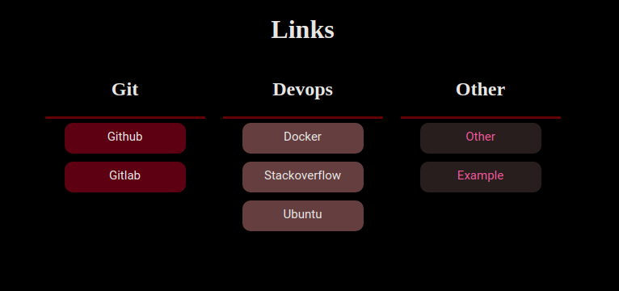

# links
A dynamic page to create a list of links that you want, just only with edit your list :)

# Usage
### _Normal:_
 - Just clone the repo and add your urls and groups to [config.yml](config/config.yml) file like samples:
   
   ```bash
   $ git clone https://github.com/daghlani/links.git
   ```
   
   ```yaml
   configs:
     global:
       LINKS_PORT: 8003
       LINKS_HOST: 
       LINKS_DEBUG_MODE: 
       LINKS_BASIC_AUTH: 
       LINKS_HTPASS_FILE_ADDRESS: 
       LINKS_TITLE: Links 
       LINKS_ADMIN_PASS: 

   targets:
     - group: 'monitoring'
       color_tag: "#40354e"
       text_color:
       urls:
         - title: Github
           url: http://github.com
           
         - title: Gitlab
           url: http://gitlab.com
           
       .
       .
       .
   ```
    As you can see, you can add `color_tag` for every group of yourself to chang the background color of columns in page. if 
    you don't set anything for that, default color will be take. (`#111`).
    
    also to change text color of any group of links, you can set the `text_color` variable as a color that you want. if 
    you don't set anything for that, default color will be take. (`#22f5ff`).
    
    ---
    > **_NOTE:_** in order to change colors, you can choose code like `#008000` or name like `green`.
    ---
    
 
 - create a virtualenv and install requirements: 
 
    ```console
    $ virtualenv -p /usr/bin/python3.8 venv
    $ source venv/bin/activate
    $ cd links
    $ pip install -r requirements.txt
    ```
    
 - Start app:
    
    ```console
    $ python app.py
    ```
    or you can install [uwsgi](https://uwsgi-docs.readthedocs.io/en/latest/Install.html) and start like below:

    ```console
    $ uwsgi --ini uwsgi.ini --die-on-term
    ```
    then you must config a webserver like [`nginx`](https://www.nginx.com/) and proxy traffics to the created socket with [`uwsgi.ini`](uwsgi.ini). example nginx config will be like this:
    ```bash
    server {
      listen 80;
      server_name 0.0.0.0;
      location / {
          include         uwsgi_params;
          uwsgi_pass      unix:/<home-app>/links/app.sock;
      }
    }
    ```
 
 - Now if you don't change the `LINKS_HOST` and `LINKS_PORT` you can see your links page on http://localhost:5000/ (or http://localhost in uwsgi mode).

    

### _Docker:_
 
 - in order to use docker version, just you need pull this docker image and run it like this:
    ```console
    $ docker run -d -p 80:80 -v $PWD/config:/app/config --name LINKS daghlani/links:latest
    ```
 - also you can use this docker-compose sample:
 
     ```yaml
     version: '3.4'
     services:
       LINKS:
         container_name: ${LINKS_CON_NAME:-LINKS}
         image: daghlani/links:${LINKS_V:-latest}
         ports:
           - "8040:80"
         volumes:
           - $PWD/config:/app/config
         restart: unless-stopped
    ```     
     create a `.env` file like this if you want to change some compose environments:
    ```shell script
    LINKS_CON_NAME=LINKS
    LINKS_V=0.3
    ```
    
 - and run it:
     ```console
     $ docker-compose up -d
     ```
       

# Authentication:
 - There is a simple basic authentication ability that you can active it by set environment variable `LINKS_BASIC_AUTH` to `on`.

    ---
    > **_NOTE:_** Also you can set password for `admin` username or use default value (`LinksAdminPass`).
    ---
    
    if you wanna create some users, you can use this commands to create/update or delete your usernames:
    
    *create / update:*
     ```console
     $ python3 app.py htpasswd -u <username> <psasword>
     ```
      *delete:*
     ```console
     $ python3 app.py htpasswd -d <username>
     ```
#
   - In _docker_ mode:

     *create / update:*
     ```console
     $ docker exec LINKS python3 app.py htpasswd -u <username> <psasword>
     ```
     *delete:*
     ```console
     $ docker exec LINKS python3 app.py htpasswd -d <username>
     ```

### ToDo
   - [ ] running normal mode in uwsgi
